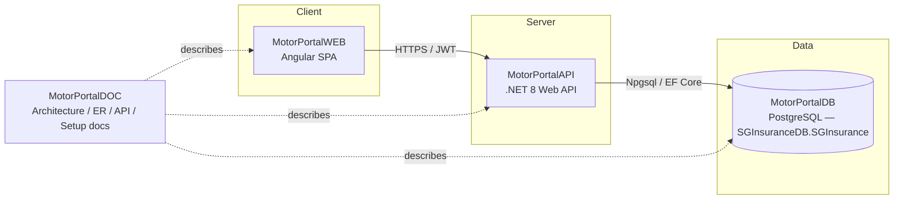
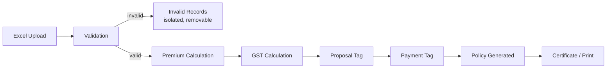

# Motor Portal — High-Level Design (HLD)

| | |
|---|---|
| **Document** | High-Level Design |
| **System** | Motor Portal — Bulk Motor Insurance Policy Issuance |
| **Version** | 1.0 |
| **Repos covered** | MotorPortalAPI · MotorPortalWEB · MotorPortalDB · MotorPortalDOC |
| **Related doc** | Motor-Portal-LLD.md |

---

## 1. Purpose & Scope

Motor Portal lets an insurance operator upload a batch of motor-vehicle
cases as an Excel file and takes that batch, unattended, through
validation, premium and GST pricing, proposal creation, real-time payment
tagging against a cash-deposit (CD) balance, and policy issuance —
ending in a printable certificate. This document describes the system at
architecture level; the companion LLD covers module-, API- and
database-level detail.

**In scope:** bulk Excel-to-policy issuance for three motor products,
batch summary/monitoring, invalid-record handling, reporting, policy
search & print, and policy cancellation.

**Out of scope:** payment gateway integration with a real PF provider
(a mock service stands in, architected to be swapped later), and
underwriting/rating engine complexity beyond a configurable premium
rule per product.

---

## 2. System Overview

| Actor | Interaction |
|---|---|
| **Operator** | Logs in, selects a product + process on the dashboard, uploads/monitors batches, resolves invalid records, tags payments, prints certificates, runs reports, searches/cancels policies |
| **System (Motor Portal)** | Validates and prices every case, tags payment against the correct master policy's CD balance, issues and certifies policies, logs every state-changing action |

**Products:** Motor Class-E, Motor Class-F, Eicher Motor
**Processes:** Motor Excel Upload, Motor Batch Summary, Motor Report,
Search & Print Policy, Policy Cancel Upload
**Batch limit:** 200 cases per uploaded file

---

## 3. Architecture Overview

Three-tier architecture, one repository per tier plus a documentation
repository:

| Repo | Responsibility |
|---|---|
| **MotorPortalWEB** | Angular SPA — all operator-facing screens |
| **MotorPortalAPI** | .NET 8 Web API — auth, business rules, orchestration, PDF/Excel generation |
| **MotorPortalDB** | PostgreSQL schema, constraints, stored procedures/functions, seed data |
| **MotorPortalDOC** | Architecture, ER diagram, API reference, setup guide, changelog |

---

## 4. Technology Stack

| Layer | Technology |
|---|---|
| Frontend | Angular (standalone components), TypeScript, Angular Router, Reactive Forms, RxJS |
| Backend | .NET 8, ASP.NET Core Web API, C#, EF Core (Npgsql provider) |
| Auth | JWT bearer tokens, bcrypt password hashing |
| Database | PostgreSQL 15+, schema `SGInsurance` in database `SGInsuranceDB` |
| File processing | ClosedXML/EPPlus (Excel), QuestPDF (certificates) |
| API docs | Swagger / OpenAPI |
| Source control | Git, 4 separate GitHub repositories |

---

## 5. Key Modules

| Module | Summary |
|---|---|
| Authentication | JWT login/logout, route guard, HTTP interceptor |
| Dashboard | Mandatory product + process selection; CD Balance drawer |
| Excel Upload | File validation, batch creation, sample template download |
| Batch Processing | Orchestrates validation → premium → GST → proposal → payment → policy |
| Invalid Records | View and bulk-clear rejected cases without blocking valid ones |
| Batch Summary | Filtered list + live counters + per-batch actions |
| Payment Tagging | CD-balance check, mock PF service, transactional deduction |
| Policy & Certificate | Policy issuance rules, PDF certificate generation, bulk print |
| Search & Print | Ad-hoc policy lookup by engine/chassis/TC/policy number |
| Reports | Policy Issue Report export to Excel |
| Policy Cancel | Bulk cancellation via Excel upload |
| Audit | Action trail for every state-changing operation |

---

## 6. Batch Lifecycle (High-Level Flow)

Six stages are user-facing; nine states drive the backend state machine.
Invalid cases branch off per-record and never block the rest of the
batch.

Backend `BATCH_MASTER.STATUS` values, in strict order:
`UPLOADED → VALIDATED → PREMIUM_CALCULATED → GST_CALCULATED →
PROPOSAL_CREATED → PAYMENT_PENDING → PAYMENT_PROCESSED →
POLICY_CREATED → PRINTED`

---

## 7. Non-Functional Requirements

| Category | Requirement |
|---|---|
| Performance | A 200-record batch must complete the full pipeline in a bounded, predictable time; heavy work (Excel parse, PDF generation) is isolated in services, not inline in controllers |
| Security | JWT auth on every endpoint except login; bcrypt-hashed passwords; no secrets committed to source; CORS restricted to the known frontend origin |
| Auditability | Every state-changing action (upload, process, payment, policy issue, print, cancel) is written to `AUDIT_LOG` |
| Data integrity | Invalid cases never block valid ones; CD-balance deduction and payment record creation happen inside one DB transaction |
| Reliability | Global exception handling returns structured errors, never a bare 500; partial failures (e.g. one case failing payment) are reported per-case, not batch-wide |
| Usability | Mobile-responsive down to ~375px; clear success/error messaging matching the reference screens |
| Maintainability | Clean repository/service layering; DTOs at the API boundary; premium/GST rules configurable, not hardcoded |

---

## 8. Deployment View

| Environment | WEB | API | DB |
|---|---|---|---|
| Local development | `ng serve` (port 4200) | `dotnet run` (Kestrel, e.g. 5000/5001) | Local PostgreSQL instance, schema from `MotorPortalDB/scripts` |
| Configuration | `environment.ts` → API base URL | `appsettings.json` + user-secrets/env vars → connection string, JWT key | `migrate.sh` env vars (`PGHOST`, `PGUSER`, etc.) |

All three run independently and communicate over HTTP(S)/SQL — no
shared process or shared codebase, which is why they live in separate
repositories.

---

## 9. Assumptions & Constraints

- Batch size is hard-capped at 200 records at both the UI and the
  database (`CHECK` constraint on `BATCH_MASTER.TOTAL_RECORDS`).
- The PF (payment) service is mocked; the interface (`IPaymentService`)
  is designed so a real integration is a drop-in implementation swap.
- Only three products and five processes exist today; both lists are
  seeded reference data (`PRODUCT_MASTER`, `FUNCTION_MASTER`), not
  hardcoded enums, so new ones can be added without a schema change.
- Single active schema (`SGInsurance`) — no multi-tenancy in this
  version.

---

## 10. Risks

| Risk | Mitigation |
|---|---|
| Large Excel files with malformed rows | Server-side validation is authoritative; client-side checks are a UX convenience only |
| CD balance race conditions under concurrent payment tagging | `sp_tag_payment` runs balance check + deduction inside a single DB transaction |
| Silent partial failures across a batch | Per-case result reporting on payment tagging and policy-cancel upload, not an all-or-nothing batch response |
| Schema drift between MotorPortalDB and EF Core entities | MotorPortalDB is the source of truth; API entities are mapped to match it, not the reverse |
