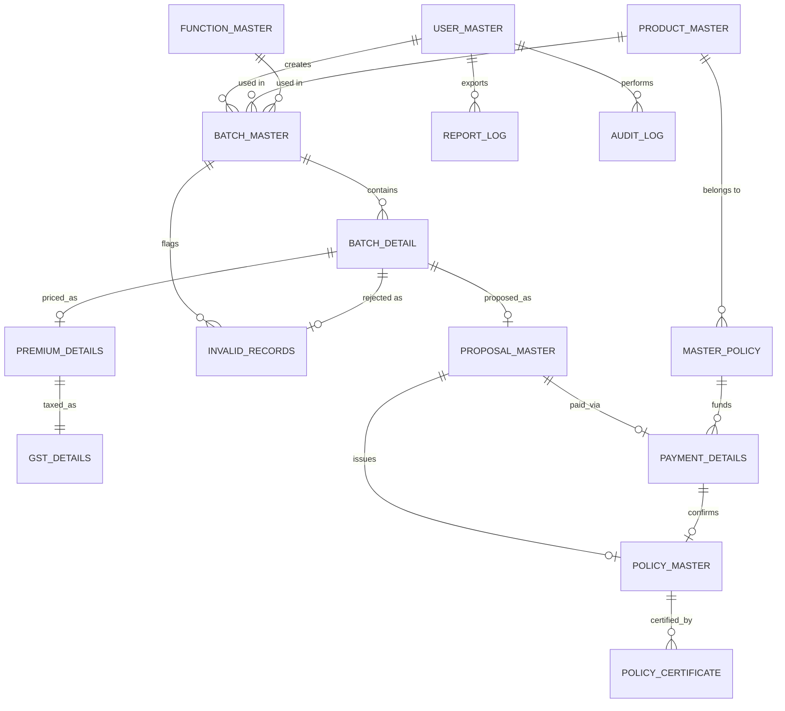
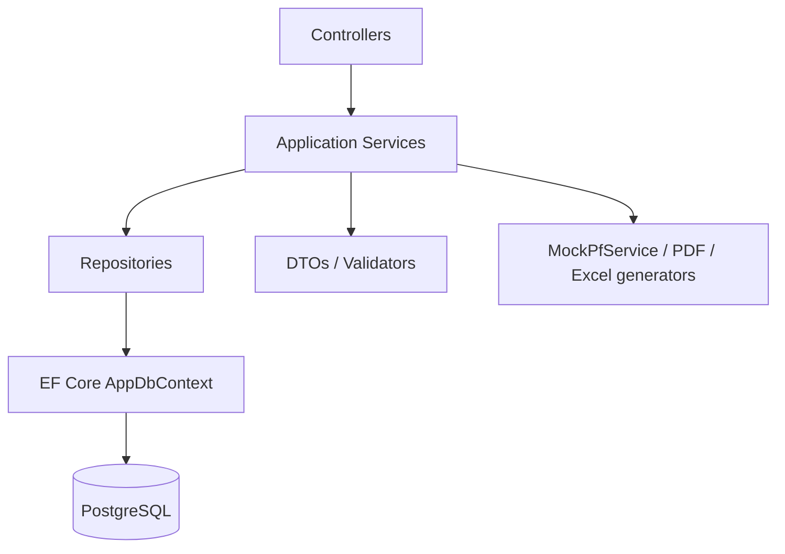
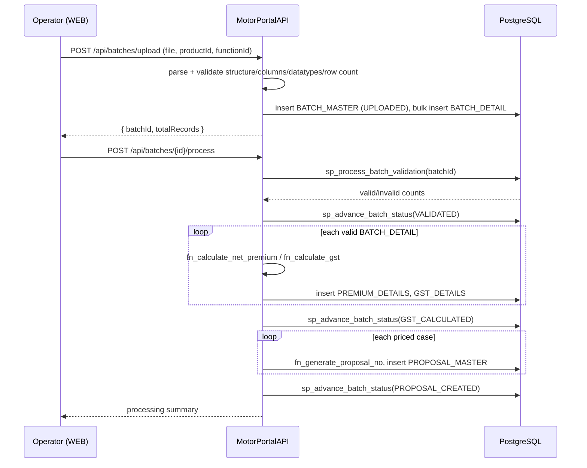
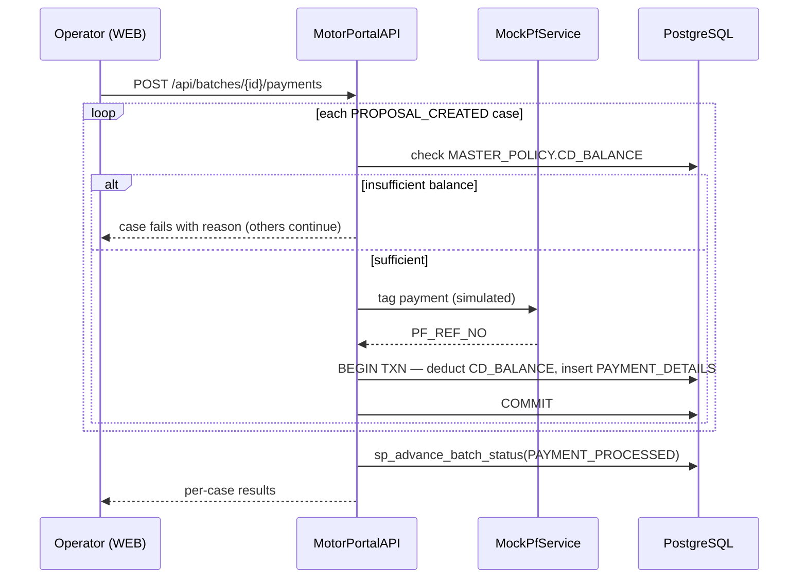

# Motor Portal — Low-Level Design (LLD)

| | |
|---|---|
| **Document** | Low-Level Design |
| **System** | Motor Portal — Bulk Motor Insurance Policy Issuance |
| **Version** | 1.0 |
| **Related doc** | Motor-Portal-HLD.md |

---

## 1. Database Design (MotorPortalDB)

Database: `SGInsuranceDB` · Schema: `SGInsurance` · Engine: PostgreSQL 15+

### 1.1 Entity list

| # | Entity | Purpose |
|---|---|---|
| 1 | USER_MASTER | Operators who log in |
| 2 | PRODUCT_MASTER | Motor Class-E / Class-F / Eicher |
| 3 | FUNCTION_MASTER | The 5 dashboard processes |
| 4 | MASTER_POLICY | Master policy + CD balance |
| 5 | BATCH_MASTER | Header for one uploaded batch |
| 6 | BATCH_DETAIL | One vehicle/customer case |
| 7 | INVALID_RECORDS | Rejected cases + remarks |
| 8 | PREMIUM_DETAILS | Premium computation per case |
| 9 | GST_DETAILS | GST over net premium |
| 10 | PROPOSAL_MASTER | Proposal per valid case |
| 11 | PAYMENT_DETAILS | Payment tagging result |
| 12 | POLICY_MASTER | Issued policy |
| 13 | POLICY_CERTIFICATE | Certificate artifact |
| 14 | REPORT_LOG | Report export audit |
| 15 | AUDIT_LOG | Action trail |

### 1.2 Columns

**USER_MASTER** — USER_ID `PK bigint`, USERNAME `varchar(50) UQ`,
PASSWORD_HASH `varchar(255)`, ROLE `varchar(30)`, STATUS `char(1)`,
CREATED_ON `timestamp`

**PRODUCT_MASTER** — PRODUCT_ID `PK int`, PRODUCT_CODE `varchar(20) UQ`,
PRODUCT_NAME `varchar(60)`, STATUS `char(1)`
Seed: `CLASS_E`/Motor Class-E, `CLASS_F`/Motor Class-F, `EICHER`/Eicher Motor

**FUNCTION_MASTER** — FUNCTION_ID `PK int`, FUNCTION_CODE `varchar(20) UQ`,
FUNCTION_NAME `varchar(60)`
Seed: `EXCEL_UPLOAD`, `BATCH_SUMMARY`, `REPORT`, `SEARCH_PRINT`, `POLICY_CANCEL`

**MASTER_POLICY** — MASTER_POLICY_ID `PK bigint`, PRODUCT_ID `FK`,
MASTER_POLICY_NO `varchar(40) UQ`, CUSTOMER_NO `varchar(30)`, CDBG_NO
`varchar(20)`, CD_BALANCE `numeric(15,2)`

**BATCH_MASTER** — BATCH_ID `PK bigint`, USER_ID `FK`, PRODUCT_ID `FK`,
FUNCTION_ID `FK`, FILE_NAME `varchar(255)`, TOTAL_RECORDS `int`
(`CHECK <= 200`), VALID_RECORDS `int`, INVALID_RECORDS `int`, STATUS
`varchar(25)`, CREATED_ON `timestamp`

**BATCH_DETAIL** — DETAIL_ID `PK bigint`, BATCH_ID `FK`,
MASTER_POLICY_NO `varchar(40)`, ENGINE_NO `varchar(30)` (indexed),
CHASSIS_NO `varchar(30)` (indexed), TC_NO `varchar(30)`, INVOICE_NO
`varchar(30)`, TRANSIT_DATE `date`, MAKE `varchar(40)`, MODEL
`varchar(80)`, RECORD_STATUS `varchar(20)`

**INVALID_RECORDS** — INVALID_ID `PK bigint`, BATCH_ID `FK`, DETAIL_ID
`FK`, TRANSIT_DATE `date`, INVOICE_NO `varchar(30)`, ENGINE_NO
`varchar(30)`, CHASSIS_NO `varchar(30)`, ERROR_REMARKS `varchar(255)`

**PREMIUM_DETAILS** — PREMIUM_ID `PK bigint`, DETAIL_ID `FK`,
BASE_PREMIUM `numeric(12,2)`, ADDON_PREMIUM `numeric(12,2)`, DISCOUNT
`numeric(12,2)`, NET_PREMIUM `numeric(12,2)`

**GST_DETAILS** — GST_ID `PK bigint`, PREMIUM_ID `FK UQ` (1:1), GST_RATE
`numeric(5,2)`, GST_AMOUNT `numeric(12,2)`, FINAL_PREMIUM `numeric(12,2)`

**PROPOSAL_MASTER** — PROPOSAL_ID `PK bigint`, DETAIL_ID `FK`,
PROPOSAL_NO `varchar(30) UQ`, PREMIUM_AMOUNT `numeric(12,2)`, STATUS
`varchar(25)`, REMARKS `varchar(120)`

**PAYMENT_DETAILS** — PAYMENT_ID `PK bigint`, PROPOSAL_ID `FK`,
MASTER_POLICY_ID `FK`, PF_REF_NO `varchar(40)`, AMOUNT `numeric(12,2)`,
PAYMENT_STATUS `varchar(20)`, TAGGED_ON `timestamp`

**POLICY_MASTER** — POLICY_ID `PK bigint`, PROPOSAL_ID `FK`, PAYMENT_ID
`FK`, POLICY_NO `varchar(40) UQ` (indexed), MAKE `varchar(40)`, MODEL
`varchar(80)`, ENGINE_NO `varchar(30)`, CHASSIS_NO `varchar(30)`, PREMIUM
`numeric(12,2)`, STATUS `varchar(20)`, ISSUED_ON `timestamp`

**POLICY_CERTIFICATE** — CERT_ID `PK bigint`, POLICY_ID `FK`, CERT_PATH
`varchar(255)`, GENERATED_ON `timestamp`

**REPORT_LOG** — REPORT_ID `PK bigint`, USER_ID `FK`, REPORT_TYPE
`varchar(40)`, FROM_DATE `date`, TO_DATE `date`, GENERATED_ON `timestamp`

**AUDIT_LOG** — AUDIT_ID `PK bigint`, USER_ID `FK`, ENTITY_NAME
`varchar(40)`, ACTION `varchar(20)`, REF_ID `varchar(40)`, TIMESTAMP
`timestamp`

### 1.3 ER diagram



### 1.4 Stored procedures / functions (PL/pgSQL)

| Name | Type | Purpose |
|---|---|---|
| `fn_calculate_net_premium` | function | `NET_PREMIUM = BASE + ADDON − DISCOUNT` |
| `fn_calculate_gst` | function | `GST_AMOUNT = NET × RATE/100`; `FINAL = NET + GST_AMOUNT` |
| `fn_generate_proposal_no` | function | Unique proposal number, e.g. `1202304500/01` |
| `fn_generate_policy_no` | function | Unique policy number, e.g. `3010/A/443668109/00/000` |
| `sp_process_batch_validation` | procedure | Validates every `BATCH_DETAIL` in a batch, writes `INVALID_RECORDS`, sets `RECORD_STATUS`, updates `BATCH_MASTER` counters |
| `sp_tag_payment` | procedure | Checks `CD_BALANCE`, deducts + inserts `PAYMENT_DETAILS` inside one transaction, or raises a meaningful error |
| `sp_advance_batch_status` | procedure | Enforces the 9-state lifecycle order; rejects out-of-sequence transitions |

### 1.5 Validation rules (`sp_process_batch_validation`)

1. Master policy exists (`MASTER_POLICY_NO` lookup)
2. Product mapping valid for the batch's `PRODUCT_ID`
3. Engine number not already registered
4. Chassis number not already registered
5. No vehicle duplication within the batch
6. No existing policy for the same vehicle
7. No duplicate transaction (same key fields) within the batch
8. All mandatory fields present
9. Datatype correctness (dates, numeric fields)

A failing case is written to `INVALID_RECORDS` with a specific
`ERROR_REMARKS` value (e.g. *"Engine and Chassis number already
registered"*) and does not block any other case in the batch.

---

## 2. Backend Design (MotorPortalAPI)

### 2.1 Layering



| Project | Contains |
|---|---|
| `MotorPortal.API` | Controllers, middleware (auth, global exception handler), Program.cs |
| `MotorPortal.Application` | DTOs, service interfaces + implementations, validators |
| `MotorPortal.Domain` | Entities, enums (batch status, record status), constants |
| `MotorPortal.Infrastructure` | `AppDbContext`, repositories, `MockPfService`, PDF/Excel generation |

### 2.2 API endpoint reference

| Method | Path | Purpose |
|---|---|---|
| POST | `/api/auth/login` | Authenticate, issue JWT |
| POST | `/api/auth/logout` | Invalidate client session |
| GET | `/api/health` | DB connectivity check |
| POST | `/api/batches/upload` | Upload Excel, create `BATCH_MASTER` + `BATCH_DETAIL` |
| GET | `/api/batches/{id}/sample-template` | Download sample `.xlsx` |
| POST | `/api/batches/{id}/process` | Run validation → premium → GST → proposal |
| GET | `/api/batches/{id}/status` | Poll current status + per-stage counts |
| GET | `/api/batches/{id}/invalid-records` | List invalid cases |
| DELETE | `/api/batches/{id}/invalid-records` | Clear invalid cases, update counters |
| POST | `/api/batches/{id}/payments` | Tag payment for eligible proposals |
| POST | `/api/policies/{id}/certificate` | Generate PDF certificate |
| GET | `/api/policies/{id}/certificate` | Stream certificate PDF |
| POST | `/api/batches/{id}/bulk-print` | Certificates for all policies in batch |
| GET | `/api/batches` | Filtered batch list (date range) |
| GET | `/api/batches/summary-counters` | Aggregate counters for dashboard cards |
| GET | `/api/master-policies` | List for CD Balance dropdown |
| GET | `/api/master-policies/{id}/cd-balance` | Current CD balance |
| POST | `/api/reports/policy-issue` | Export Policy Issue Report `.xlsx` |
| GET | `/api/policies/search` | Search by engine/chassis/TC/policy number |
| POST | `/api/policies/cancel-upload` | Bulk cancel via Excel |

All endpoints except `/api/auth/login` and `/api/health` require a
valid JWT bearer token.

### 2.3 Sequence — Excel Upload → Process



### 2.4 Sequence — Payment Tagging



### 2.5 Security design

- **Password storage:** bcrypt hash in `USER_MASTER.PASSWORD_HASH`, never plaintext.
- **Auth flow:** `POST /api/auth/login` verifies credentials, issues a
  short-lived JWT (issuer/audience/key from environment/user-secrets).
- **Authorization:** `[Authorize]` on all controllers except
  `AuthController`; a custom interceptor on the Angular side attaches
  the bearer token and redirects to login on `401`.
- **Transport:** HTTPS in any non-local environment; CORS restricted to
  the known Angular origin.
- **Auditability:** an action filter writes `AUDIT_LOG` rows for every
  state-changing endpoint (upload, process, payment, policy issue,
  print, cancel) — not on read-only `GET`s.

### 2.6 Error handling

A global exception-handling middleware returns a consistent shape:

```json
{ "statusCode": 400, "message": "Insufficient CD balance for master policy DL-3010/A/1485551", "traceId": "..." }
```

Business-rule failures (insufficient balance, out-of-sequence status
transition, malformed Excel) are raised as typed exceptions and mapped
to 4xx responses with a specific message — never surfaced as a bare 500.

---

## 3. Frontend Design (MotorPortalWEB)

### 3.1 Module/component tree

```
src/app/
  core/        guards/AuthGuard, interceptors/AuthInterceptor,
               services/AuthService+ApiService, models/*.ts
  shared/      components (upload widget, data grid, status badge),
               directives, pipes
  layout/      header (brand, welcome, clock, logout),
               sidebar (Dashboard, Excel Upload, Batch Summary,
               Reports, Search & Print, Policy Cancel), footer
  features/
    authentication/login
    dashboard                (product+process selection, CD balance drawer)
    excel-upload
    batch-summary
    batch-processing         (live 6-stage pipeline view)
    invalid-records
    reports
    policy-search
    policy-certificate
    policy-cancel
```

### 3.2 State & data flow

- `AuthService` holds the JWT and current user; `AuthGuard` protects all
  feature routes; `AuthInterceptor` attaches the token and handles 401.
- Each feature module owns its own API calls through a thin
  `ApiService` (typed HTTP wrapper) — no shared mutable state beyond the
  authenticated user and the currently selected product/process, which
  is passed via route state from the Dashboard.
- `batch-processing` polls `GET /api/batches/{id}/status` on an
  interval to reflect genuine backend progress — it does not simulate
  timing client-side.

### 3.3 Theming

CSS custom properties in a shared `_theme.css`: navy `#00305B`
background, orange gradient `#EE7B2E → #C1402C` navbar, solid accent
`#EC6608` for buttons/panels, white cards, green success / salmon error
text — applied consistently via shared classes, not per-component
hardcoded hex values.

---

## 4. Naming & Conventions Recap

- Table/entity names are fixed (Section 1.1) — never renamed across DB,
  EF Core entities, or DTO base names.
- Batch status values are fixed strings matching the state machine
  exactly (Section 1.4 / HLD §6) — used verbatim in DB, API and UI.
- Git: Conventional Commits (`feat:`, `fix:`, `docs:`, `chore:`), one
  logical change per commit, pushed to `origin main` per repo.
