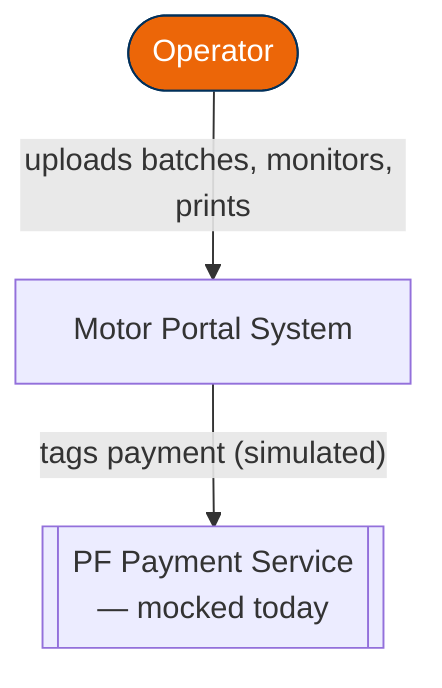
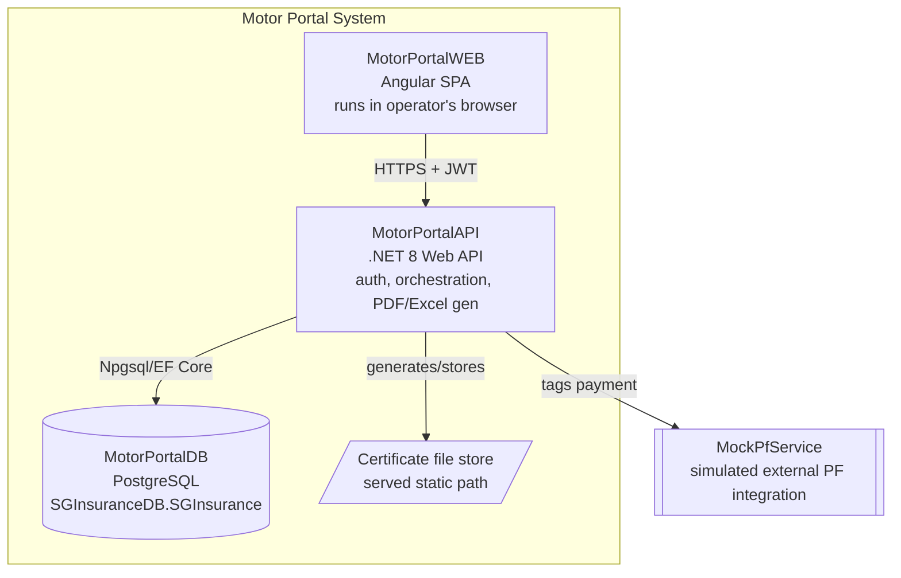
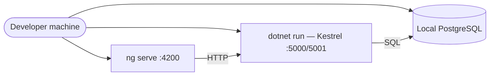
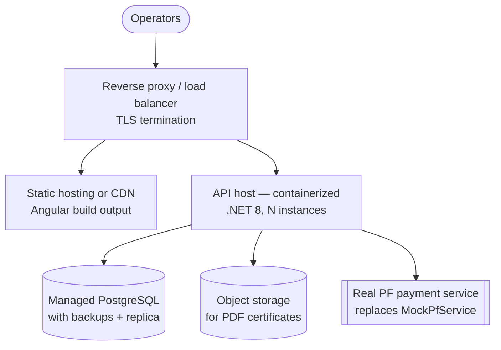

# Motor Portal — Solution Architecture Document (SAD)

| | |
|---|---|
| **Document** | Solution Architecture Document |
| **System** | Motor Portal — Bulk Motor Insurance Policy Issuance |
| **Version** | 1.0 |
| **Related docs** | Motor-Portal-HLD.md (component-level design) · Motor-Portal-LLD.md (schema/API/sequence detail) |

This document sits above the HLD/LLD: it captures *why* the solution is
shaped the way it is — principles, technology choices, integration and
deployment topology, and quality attributes — rather than the module
and schema detail already covered in those two documents.

---

## 1. Executive Summary

Motor Portal replaces a manual, one-policy-at-a-time issuance process
with a bulk, Excel-driven pipeline: an operator uploads up to 200 motor
insurance cases at once, and the system validates, prices (premium +
GST), proposes, pays (against a cash-deposit balance), issues, and
certifies each case automatically — isolating and reporting failures
per-case rather than failing the whole batch. The solution is a
three-tier web application (Angular / .NET 8 / PostgreSQL) delivered as
four independently versioned repositories.

---

## 2. Business Context & Objectives

| Driver | Solution response |
|---|---|
| Manual single-policy issuance is slow at volume | Bulk Excel upload, up to 200 cases/batch, processed as one pipeline |
| Errors in source data block whole batches today | Per-case validation; invalid cases isolated in `INVALID_RECORDS` without blocking valid ones |
| Payment must respect a pre-funded CD balance per master policy | Real-time balance check + transactional deduction at payment-tagging time |
| Operators need visibility into where a batch stands | Batch Summary counters + live per-stage status polling |
| Policies must be certifiable and re-printable | PDF certificate generation, single and bulk print, searchable after the fact |
| Full traceability for compliance | `AUDIT_LOG` on every state-changing action; `REPORT_LOG` on every report export |

---

## 3. Architecture Principles

1. **Separation by deployable unit, not just by layer.** Frontend,
   backend and database live in three separate repositories
   (MotorPortalWEB / API / DB) plus a documentation repository
   (MotorPortalDOC), so each can be versioned, reviewed and deployed on
   its own cadence without cross-repo coupling in the codebase itself.
2. **Database as source of truth for structure.** Schema, constraints
   and core business rules that must never be bypassed (batch size cap,
   lifecycle ordering, CD-balance arithmetic) live as PostgreSQL
   constraints and PL/pgSQL procedures — not only in application code —
   so they hold even if a future client talks to the database directly
   or a bug ships in the API layer.
3. **Fail small, not big.** Every batch-level operation (validation,
   payment tagging, cancellation) reports success/failure per case. A
   single bad row never voids 199 good ones.
4. **Mock the external dependency, keep its shape real.** The PF
   (payment) service is simulated today via `MockPfService` behind an
   `IPaymentService` interface, so swapping in the real payment
   provider later is a one-class change, not a redesign.
5. **Stateless API, thin client.** The Angular SPA holds no business
   logic beyond form/UX validation; every authoritative decision
   (pricing, eligibility, balance sufficiency) is made server-side and
   re-validated there even if the UI already checked it.
6. **Configuration over hardcoding.** Premium rules and GST rate are
   configurable per product, not embedded in controller code, so a
   pricing change doesn't require a redeploy of business logic.

---

## 4. Solution Architecture — Context View (C4 Level 1)

## 5. Solution Architecture — Container View (C4 Level 2)

---

## 6. Logical Architecture

| Layer | Responsibility | Lives in |
|---|---|---|
| Presentation | Screens, forms, client-side UX validation, polling for live status | MotorPortalWEB |
| API / Orchestration | AuthN/AuthZ, request validation, pipeline orchestration, PDF/Excel generation | MotorPortalAPI (Controllers) |
| Application / Business | Premium & GST rules, batch lifecycle enforcement, payment eligibility | MotorPortalAPI (Application services) |
| Data access | Repository pattern over EF Core | MotorPortalAPI (Infrastructure) |
| Data / Integrity | Schema, constraints, stored procedures for rules that must always hold | MotorPortalDB |

This is a classic layered architecture rather than microservices — the
business domain (bulk policy issuance) is cohesive enough that
splitting it into separately deployed services would add operational
cost without a corresponding benefit at this scale.

---

## 7. Deployment Architecture

### 7.1 Local / development topology (current)

### 7.2 Target production topology (recommended)

Moving from §7.1 to §7.2 requires no application redesign: it's a
configuration and hosting change (connection strings, storage path,
`IPaymentService` implementation) precisely because of the layering and
interface boundaries set out in §6 and Principle 4.

---

## 8. Integration Architecture

| Integration | Type | Direction | Notes |
|---|---|---|---|
| WEB ↔ API | Synchronous REST over HTTPS, JWT bearer | Request/response | CORS restricted to known frontend origin |
| API ↔ DB | Npgsql/EF Core, plus direct calls to PL/pgSQL procedures/functions | Request/response, transactional | Business-critical rules enforced at the DB layer, not only in C# |
| API ↔ PF Service | `IPaymentService` → `MockPfService` (today), real HTTP client (future) | Request/response, simulated latency | Swappable without touching calling code |
| API → Certificate store | File write/stream | Outbound | Local static path today; object storage in §7.2 |
| API → Excel export | In-process generation (ClosedXML/EPPlus) | Outbound file | Used by Reports and sample-template download |

No message queue or event bus is used — every workflow in this system
is operator-initiated and synchronous-enough (batch of ≤200 records)
that request/response suffices without added infrastructure.

---

## 9. Data Architecture

- **System of record:** PostgreSQL `SGInsuranceDB.SGInsurance` — all
  15 entities described in the LLD.
- **Data flow:** Excel (source) → `BATCH_DETAIL` (raw) →
  `PREMIUM_DETAILS`/`GST_DETAILS` (priced) → `PROPOSAL_MASTER` →
  `PAYMENT_DETAILS` → `POLICY_MASTER` → `POLICY_CERTIFICATE` (output
  artifact) → `vw_policy_issue_report` (reporting view) → exported
  `.xlsx` (Reports module).
- **Reference data:** `PRODUCT_MASTER`, `FUNCTION_MASTER`,
  `MASTER_POLICY` — seeded, low-change data that drives dashboard
  options and CD-balance checks.
- **Audit trail:** `AUDIT_LOG` (actions) and `REPORT_LOG` (exports) are
  append-only by design — no update/delete path is exposed for either.
- **Retention:** batches and their downstream records are retained
  indefinitely by default (no purge job defined in this version);
  revisit if volume requires archiving.

---

## 10. Security Architecture

| Concern | Approach |
|---|---|
| Authentication | JWT issued on successful login; credentials checked via bcrypt hash comparison against `USER_MASTER` |
| Authorization | `[Authorize]` on every controller except auth/health; role field (`USER_MASTER.ROLE`) available for future role-based restrictions |
| Transport security | HTTPS everywhere outside local dev; CORS locked to the known SPA origin |
| Secret management | Connection strings and JWT signing key via environment variables / user-secrets — never committed to source |
| Session handling | Stateless JWT; interceptor on the SPA attaches the token and redirects to login on `401` |
| Audit | Every state-changing action logged to `AUDIT_LOG` with user, entity, action and reference ID |
| Input validation | Server-side validation is authoritative for every workflow (Excel structure, payment eligibility, cancellation rows) — client-side checks are UX only |

---

## 11. Quality Attributes (NFR Summary)

| Attribute | Target / approach |
|---|---|
| Performance | Batch operations bounded by the 200-record cap; heavy work (parsing, PDF generation) isolated in dedicated services |
| Scalability | Stateless API instances can scale horizontally behind a load balancer (§7.2); PostgreSQL can move to a managed service with read replicas if reporting load grows |
| Availability | No single-batch operation should be able to take down another operator's session; per-case failure isolation limits blast radius |
| Maintainability | Layered architecture, DTOs at the API boundary, configuration-driven pricing rules, Conventional Commit history per repo |
| Portability | Standard PostgreSQL syntax only (no vendor-specific extensions), containerizable .NET 8 API, static-buildable Angular SPA |
| Observability | Structured logging with request IDs on the API; `AUDIT_LOG`/`REPORT_LOG` provide business-level traceability |

---

## 12. Technology Stack — Rationale

| Choice | Why |
|---|---|
| Angular over a lighter framework | Reactive Forms + Router + strict typing suit a form-heavy, multi-screen operator portal; matches the reference application's existing UX patterns |
| .NET 8 Web API | Mature EF Core/Postgres support, strong typing, built-in DI, first-class Swagger/OpenAPI tooling |
| PostgreSQL | Open-source, strong PL/pgSQL support for enforcing business rules at the DB layer, no licensing cost at scale |
| JWT over server-session auth | Stateless API fits horizontal scaling and a decoupled SPA/API deployment model |
| QuestPDF / ClosedXML-EPPlus | In-process PDF/Excel generation without an external service dependency |
| Four separate repos | Independent versioning/deployment cadence per tier; matches how the teams (frontend/backend/DB/docs) actually divide work |

---

## 13. Environment & Branching Strategy (recommended)

| Environment | Purpose | Promotion |
|---|---|---|
| **Local** | Individual development, seeded sample data | — |
| **Dev/Integration** | Shared environment for cross-repo integration testing | Merge to `dev` branch per repo |
| **UAT** | Business sign-off against realistic data volumes | Merge to `main`/release branch |
| **Production** | Live operator use | Tagged release from `main` |

Each repository tags releases independently; MotorPortalDOC's
`changelog.md` records which combination of repo versions makes up a
given release.

---

## 14. Risks & Architectural Mitigations

| Risk | Mitigation |
|---|---|
| Real PF service has different semantics than the mock | `IPaymentService` interface isolates the swap to one implementation class |
| Reporting queries degrade batch-processing performance at scale | `vw_policy_issue_report` is a read-only view; consider a read replica if reporting load grows (§7.2) |
| Four-repo model causes version-mismatch bugs across WEB/API | MotorPortalDOC's API reference and changelog track compatible version sets; integration testing (LLD §9 smoke test) runs before release |
| Business rules duplicated between C# and PL/pgSQL drift apart | Database is the enforced source of truth for the rules that must never be bypassed (batch cap, lifecycle order, balance arithmetic); C#-side checks are a fast-fail convenience, not the final authority |

---

## 15. Appendix

**Related documents:** Motor-Portal-HLD.md, Motor-Portal-LLD.md,
MotorPortalDOC `docs/architecture.md`, `docs/api-reference.md`,
`docs/setup-guide.md`.

**Glossary:**
- **CD Balance** — cash-deposit balance held against a master policy,
  drawn down at payment-tagging time.
- **Batch** — one uploaded Excel file, capped at 200 cases.
- **PF Service** — the payment-tagging integration point, mocked in
  this version.
