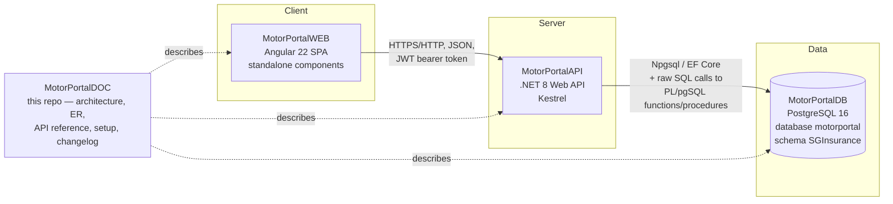
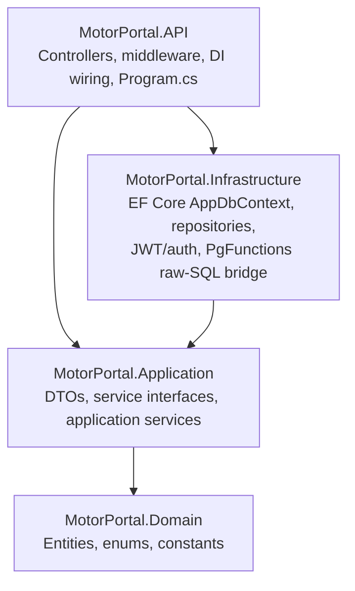

# Motor Portal — Architecture

This describes the system as it actually shipped, verified against the code
in all three application repos. It supersedes the equivalent sections of
`Motor-Portal-HLD.md` / `Motor-Portal-Solution-Architecture.md` wherever
those reference documents differ from what was actually built (they
describe original intent; the code below is the source of truth).

## Component view

This matches `Motor-Portal-HLD.md` section 3 — the three-tier shape held
throughout the build. The one correction to make against the original
diagram: PostgreSQL is verified running as **15/16** in practice (16 in the
actual local dev/verification environment; the DB repo's own README states
"PostgreSQL 15+"), and the SPA is Angular **22** (`@angular/core: ^22.0.0`
in `MotorPortalWEB/package.json`), not an unspecified "Angular" version.

## The 4-repo layout

| Repo | Contains | Responsibility |
|---|---|---|
| **MotorPortalWEB** | Angular 22 SPA, standalone components, TypeScript | Every operator-facing screen: login, dashboard, Excel upload, batch summary, invalid records, batch processing, certificates, reports, search & print, policy cancel |
| **MotorPortalAPI** | .NET 8 Web API, 4-project layered solution | Auth (JWT), request validation, orchestration of the batch pipeline, Excel parsing/generation, PDF certificate generation, all business endpoints |
| **MotorPortalDB** | PostgreSQL DDL, PL/pgSQL functions/procedures, seed data, `migrate.sh`/`rollback.sql` | Schema and the business rules that must never be bypassed: batch size cap, lifecycle ordering (`sp_advance_batch_status`), CD-balance arithmetic (`sp_tag_payment`), premium/GST math (`fn_calculate_net_premium`, `fn_calculate_gst`) |
| **MotorPortalDOC** | This repo | Architecture, ER diagram, batch lifecycle, API reference, setup guide, changelog, smoke-test checklist |

## API internal layering

Confirmed from `MotorPortalAPI`'s solution structure (4 projects, referenced
`API -> Application`, `Infrastructure -> Application -> Domain`):

The database is **database-first**: every table/column already exists
(owned by MotorPortalDB) in lowercase snake_case, and EF Core's
`AppDbContext` maps to that exact schema via Fluent API
(`HasDefaultSchema("SGInsurance")`, explicit `.ToTable(...)` /
`.HasColumnName(...)` per entity — verified directly in
`MotorPortal.Infrastructure/Data/AppDbContext.cs`). The API does not run EF
Core migrations against this database; the PL/pgSQL functions/procedures
that enforce premium/GST math, batch validation, payment tagging and
lifecycle transitions are invoked via raw SQL from
`MotorPortal.Infrastructure.Services.PgFunctions` rather than re-implemented
in C#.

## Why split into 4 repos (verified rationale)

`Motor-Portal-Solution-Architecture.md` (§3, Principle 1 and §12) gives the
original rationale for the 4-repo split. Having built and integration-tested
all three application repos, that rationale still holds and is worth
restating in concrete terms now that the system is real rather than planned:

1. **Independent versioning and deployment cadence.** WEB, API and DB
   changed at different rates during the build (DB was frozen early once
   the 15-entity schema and functions were verified; WEB and API iterated
   independently on top of it). Each repo tags/releases on its own
   schedule with no cross-repo code coupling — only an HTTP contract
   (WEB↔API) and a SQL/schema contract (API↔DB).
2. **Database as source of truth for structure.** The schema and the rules
   that must never be bypassed (batch cap, lifecycle ordering, CD-balance
   deduction) live as PostgreSQL constraints and PL/pgSQL procedures, not
   only in C#. This was exercised for real during integration testing: a
   bug fix to `sp_tag_payment`'s error message was made and applied
   directly in MotorPortalDB (`CREATE OR REPLACE PROCEDURE`) without
   touching MotorPortalAPI at all — proof the boundary works as intended.
3. **Stateless API, thin client.** The Angular SPA holds no business logic
   beyond form/UX validation (confirmed by reading every `features/*`
   component — pricing, eligibility and balance sufficiency are decided
   server-side and re-validated there even when the UI already checked
   them).
4. **Swappable external dependency.** The payment facilitator is mocked
   (`MockPfService` behind `IPfGatewayService`) specifically so the real
   integration can be dropped in later as one new class, isolated by the
   MotorPortalAPI/Infrastructure boundary — no redesign of WEB or DB
   required.
5. **Matches how the work was actually organized.** Each repo maps to one
   coherent set of changes and one technology stack; a single combined
   repo would not have made the parallel WEB/API build phases (see
   `changelog.md`) any easier to review or land.

No part of this rationale broke down during the build: at no point did a
change require touching more than the intended boundary (HTTP contract for
WEB↔API, SQL/PL-pgSQL contract for API↔DB), including the two real bugs
found during the final integration pass (see `changelog.md` and
`docs/smoke-test.md`) — each was fixed entirely inside its own repo.
