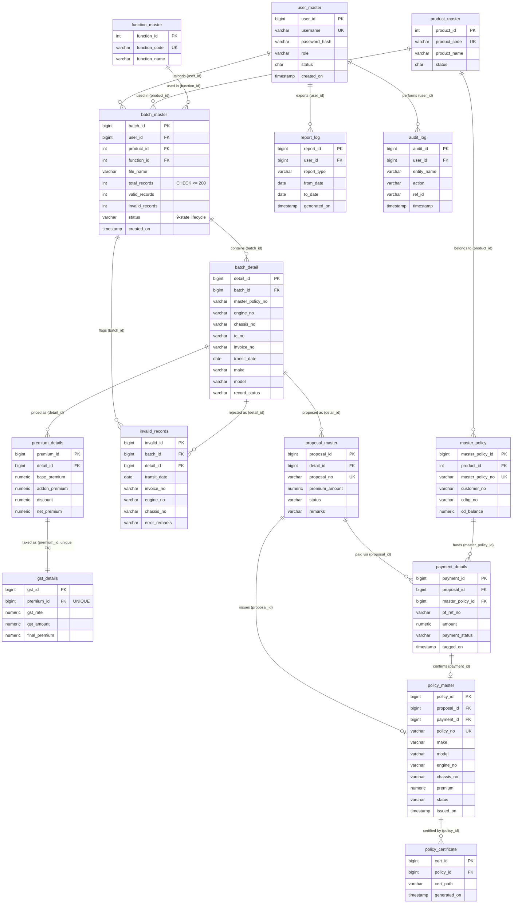

# Motor Portal — ER Diagram

**Naming note:** the SQL scripts in `MotorPortalDB/scripts/02_tables/*.sql`
are *written* in UPPER_SNAKE_CASE (e.g. `CREATE TABLE USER_MASTER (...)`),
but PostgreSQL folds all unquoted identifiers to lowercase — so the real,
physical table and column names in the running database are lowercase
snake_case (`user_master`, `batch_master`, `master_policy_id`, ...). This is
confirmed independently by `MotorPortalAPI`'s EF Core mapping, which maps
every entity to the lowercase form explicitly (e.g.
`e.ToTable("user_master", Schema); e.Property(x => x.UserId).HasColumnName("user_id")`
in `AppDbContext`), and by the DB repo's own smoke-tested `psql` queries
(`SELECT count(*) FROM user_master`). The original LLD's use of
UPPER_SNAKE_CASE names is fine as **logical/conceptual** shorthand in prose
— this document and any literal SQL/JSON below use the real lowercase
names.

## The 15 entities

`user_master`, `product_master`, `function_master`, `master_policy`,
`batch_master`, `batch_detail`, `invalid_records`, `premium_details`,
`gst_details`, `proposal_master`, `payment_details`, `policy_master`,
`policy_certificate`, `report_log`, `audit_log` — all in schema
`"SGInsurance"` of database `SGInsuranceDB`.

## Diagram

## Cardinality notes (verified against `scripts/02_tables` and `03_constraints_indexes.sql`)

- `batch_detail.batch_id`, `invalid_records.batch_id`/`detail_id` are
  `ON DELETE CASCADE` — deleting a batch cascades to its details and any
  invalid-record rows.
- `premium_details.detail_id` and `gst_details.premium_id` are also
  `ON DELETE CASCADE` from `batch_detail`/`premium_details` respectively;
  `gst_details.premium_id` carries a `UNIQUE` constraint, making
  `premium_details ||--|| gst_details` a strict one-to-one (a premium row
  has at most one GST row, and never more).
- `proposal_master.detail_id` cascades from `batch_detail` but is **not**
  unique in the DDL itself — in practice the API's `ProcessBatchAsync`
  creates at most one proposal per valid `batch_detail` row, one-to-zero-or-one
  by application convention rather than a DB constraint.
- `payment_details.proposal_id` cascades from `proposal_master`;
  `payment_details.master_policy_id` is a plain (non-cascading) FK to
  `master_policy` — a master policy is never deleted by a payment being
  deleted, and `sp_tag_payment` deducts `master_policy.cd_balance`
  transactionally with the `payment_details` insert.
- `policy_master.proposal_id` and `policy_master.payment_id` are plain FKs
  (no cascade) — a policy, once issued, is not automatically removed if the
  originating proposal/payment row is (there is no delete path for either
  in the shipped API).
- `policy_certificate.policy_id` is `ON DELETE CASCADE` from
  `policy_master`.
- `batch_master.total_records` carries `CHECK (total_records <= 200)` —
  the 200-case batch cap is enforced at the database layer, not only in
  the UI/API.
- `invalid_records` is intentionally **not** a blocking join: it exists
  alongside `batch_detail`, not instead of it, precisely so a rejected case
  is isolated without ever removing or blocking the batch's valid rows (see
  `docs/batch-lifecycle.md`).
